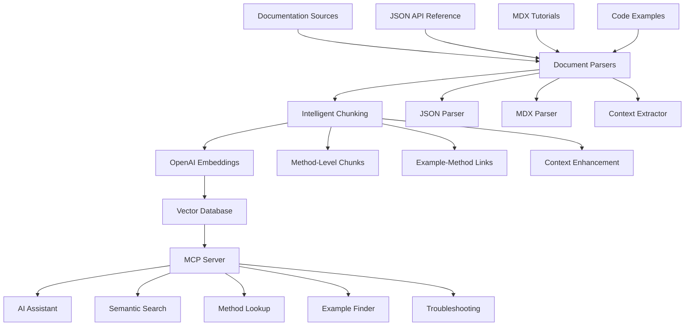

# PrivMX Documentation MCP Server

An intelligent Model Context Protocol (MCP) server that provides AI assistants with semantic access to PrivMX WebEndpoint documentation through vector embeddings and advanced document processing.

## 🎯 What This Does

This MCP server transforms your PrivMX documentation into an AI-accessible knowledge base that can:

- **Answer complex questions** about your API with accurate, contextual responses
- **Provide complete code examples** for specific use cases
- **Suggest best practices** and common patterns
- **Help troubleshoot** common issues with detailed solutions
- **Guide developers** through multi-step workflows

Instead of developers searching through static docs, they can ask natural language questions like:
- "How do I create a thread with custom metadata?"
- "What's the complete workflow for setting up encrypted messaging?"
- "Why is my connection failing and how do I fix it?"

## 📊 Current Development Status

### ✅ Completed Components (Phase 1-3.5)
- **📋 Monorepo Setup**: Turbo repo with shared types and utilities
- **🔍 Document Parsing**: JSON API + MDX tutorial parsers
- **✂️ Intelligent Chunking**: 4 advanced strategies implemented
- **🔧 Enhancement System**: Automatic context and metadata enrichment
- **⚡ Optimization Pipeline**: Quality scoring, deduplication, size optimization
- **🧪 Comprehensive Testing**: Unit tests with >80% coverage
- **🏗️ Build System**: TypeScript compilation with proper module resolution

### 🚧 In Development (Phase 4-5)
- **🤖 OpenAI Integration**: Embedding generation pipeline
- **🗄️ Vector Database**: ChromaDB integration and indexing
- **🔍 Semantic Search**: Hybrid search implementation
- **📡 MCP Server**: Protocol implementation and tool endpoints

## 🏗 Architecture Overview



## 🔄 How It Works

### 1. Document Processing Pipeline

#### **JSON API Reference Processing**
```javascript
// Input: Your structured JSON API docs
{
  "classes": [{
    "name": "Endpoint",
    "methods": [{
      "name": "setup",
      "description": "Initialize the library",
      "params": [...],
      "examples": [...]
    }]
  }]
}

// Processing: Context Enhancement
{
  "chunk_id": "endpoint_setup_method",
  "content": "Endpoint.setup() initializes the PrivMX library...",
  "context": {
    "class": "Endpoint",
    "namespace": "Core",
    "dependencies": [],
    "importance": "critical",
    "commonMistakes": ["Forgetting to await", "Missing WASM assets"]
  },
  "metadata": {
    "type": "method",
    "tags": ["initialization", "setup", "critical"],
    "relatedMethods": ["connect", "createThreadApi"]
  }
}
```

#### **MDX Tutorial Processing**
```markdown
<!-- Input: Your MDX documentation -->
## Creating Threads

Creating a basic Thread:

```js
const threadId = await threadApi.createThread(
  CONTEXT_ID, users, managers, publicMeta, privateMeta
);
```

<!-- Processing: Example-Method Linking -->
{
  "chunk_id": "thread_creation_example",
  "content": "Creating a basic Thread with users and managers...",
  "codeExample": {
    "language": "javascript",
    "code": "const threadId = await threadApi.createThread(...)",
    "explanation": "This creates an encrypted message thread..."
  },
  "linkedMethods": ["ThreadApi.createThread"],
  "workflow": "thread_management",
  "tags": ["thread", "creation", "example"]
}
```

### 2. Intelligent Chunking Strategy

#### **Method-Level Chunking**
Each API method becomes a semantically rich chunk:

```typescript
interface MethodChunk {
  // Core content
  methodName: string;
  description: string;
  fullSignature: string;
  
  // Enhanced context
  prerequisiteSteps: string[];
  commonUseCases: string[];
  relatedMethods: string[];
  troubleshooting: TroubleshootingInfo[];
  
  // Code examples
  basicExample: CodeExample;
  advancedExamples: CodeExample[];
  
  // AI hints
  whenToUse: string;
  whenNotToUse: string;
  commonMistakes: string[];
}
```

#### **Context-Aware Enhancement**
Each chunk includes broader context:

```typescript
// Instead of just: "Creates a thread"
// We create: 
const enhancedChunk = {
  content: `
    ThreadApi.createThread() creates an encrypted message thread in PrivMX.
    
    PREREQUISITES: 
    - Must call Endpoint.setup() first
    - Requires active Connection from Endpoint.connect()
    - Need ThreadApi instance from Endpoint.createThreadApi()
    
    PARAMETERS:
    - contextId: The Context where thread will be created
    - users: Array of user objects with userId and pubKey
    - managers: Subset of users who can manage the thread
    
    COMMON PATTERN:
    1. Setup connection
    2. Create ThreadApi
    3. Define users and managers
    4. Call createThread with metadata
    
    RELATED OPERATIONS:
    - listThreads() to see existing threads
    - updateThread() to modify thread later
    - deleteThread() to remove thread
  `,
  metadata: {
    importance: "high",
    complexity: "medium",
    prerequisites: ["setup", "connect", "createThreadApi"]
  }
};
```

### 3. Embedding Generation

#### **Multi-Strategy Embedding**
```typescript
class EmbeddingGenerator {
  async generateEmbeddings(chunk: DocumentChunk) {
    // Primary content embedding
    const contentEmbedding = await this.openai.embeddings.create({
      model: "text-embedding-3-large",
      input: chunk.enhancedContent,
      dimensions: 1536
    });
    
    // Query-focused variations
    const queryVariations = [
      `How to ${chunk.methodName}`,
      `${chunk.methodName} example`,
      `${chunk.methodName} error troubleshooting`,
      chunk.commonUseCases.join(' ')
    ];
    
    const queryEmbeddings = await Promise.all(
      queryVariations.map(query => 
        this.openai.embeddings.create({
          model: "text-embedding-3-large", 
          input: query
        })
      )
    );
    
    return {
      primary: contentEmbedding,
      queryVariations: queryEmbeddings,
      metadata: chunk.metadata
    };
  }
}
```

### 4. Vector Database Operations

#### **Hybrid Search Implementation**
```typescript
class DocumentSearcher {
  async search(query: string, options: SearchOptions) {
    // 1. Semantic search via embeddings
    const queryEmbedding = await this.generateEmbedding(query);
    const semanticResults = await this.vectorDB.search({
      vector: queryEmbedding,
      limit: 20,
      threshold: 0.7
    });
    
    // 2. Keyword search for exact matches
    const keywordResults = await this.vectorDB.search({
      filter: {
        content: { $text: query }
      }
    });
    
    // 3. Metadata filtering
    const filteredResults = this.applyFilters(
      [...semanticResults, ...keywordResults],
      options.filters
    );
    
    // 4. Intelligent ranking
    return this.rankResults(filteredResults, query);
  }
  
  private rankResults(results: SearchResult[], query: string) {
    return results
      .map(result => ({
        ...result,
        score: this.calculateRelevanceScore(result, query)
      }))
      .sort((a, b) => b.score - a.score)
      .slice(0, 10);
  }
}
```

### 5. MCP Server Tools

The server exposes several specialized tools:

#### **search_documentation**
```typescript
{
  name: "search_documentation",
  description: "Search PrivMX documentation semantically",
  inputSchema: {
    type: "object",
    properties: {
      query: { type: "string" },
      filters: {
        type: "object",
        properties: {
          namespace: { type: "string" },
          importance: { enum: ["critical", "high", "medium", "low"] },
          type: { enum: ["method", "class", "example", "troubleshooting"] }
        }
      },
      limit: { type: "number", default: 5 }
    }
  }
}
```

#### **get_complete_workflow**
```typescript
{
  name: "get_complete_workflow",
  description: "Get step-by-step workflow for complex tasks",
  inputSchema: {
    properties: {
      task: { 
        type: "string",
        description: "e.g., 'setup encrypted messaging', 'create thread with files'"
      }
    }
  }
}
```

## 🚀 Getting Started

### Prerequisites
- Node.js 18+
- OpenAI API key
- Docker (optional, for vector database)

### Installation

```bash
# Clone the repository
git clone https://github.com/your-org/privmx-docs-mcp
cd privmx-docs-mcp

# Install dependencies
npm install

# Set up environment
cp .env.example .env
# Edit .env with your OpenAI API key and vector DB config
```

### Configuration

```yaml
# config/default.yml
openai:
  apiKey: ${OPENAI_API_KEY}
  model: "text-embedding-3-large"
  dimensions: 1536
  
vectorDatabase:
  type: "chroma" # or "pinecone", "weaviate"
  url: "http://localhost:8000"
  collection: "privmx-docs"
  
chunking:
  maxChunkSize: 1500
  overlapSize: 200
  strategy: "method-aware"
  
server:
  name: "privmx-docs"
  version: "1.0.0"
  port: 3000
```

### Initial Setup

```bash
# 1. Start vector database (if using Chroma)
docker run -p 8000:8000 chromadb/chroma

# 2. Process and index documentation
npm run index-docs

# 3. Start MCP server
npm run start

# 4. Test the server
npm run test:integration
```

## 📖 Usage Examples

### With Claude Desktop

Add to your Claude Desktop MCP configuration:

```json
{
  "mcpServers": {
    "privmx-docs": {
      "command": "node",
      "args": ["/path/to/privmx-docs-mcp/dist/server.js"],
      "env": {
        "OPENAI_API_KEY": "your-api-key"
      }
    }
  }
}
```

### Sample Interactions

**User**: "How do I set up PrivMX and create my first encrypted thread?"

**AI Response**: Based on the PrivMX documentation, here's the complete workflow:

1. **Initialize the library**:
```javascript
await Endpoint.setup('/path/to/wasm/assets/');
```

2. **Establish connection**:
```javascript
const connection = await Endpoint.connect(
  userPrivateKey,
  solutionId, 
  bridgeUrl
);
```

3. **Create Thread API**:
```javascript
const threadApi = await Endpoint.createThreadApi(connection);
```

4. **Create your first thread**:
```javascript
const users = [
  {userId: "user1", pubKey: "user1_public_key"},
  {userId: "user2", pubKey: "user2_public_key"}
];
const managers = [{userId: "user1", pubKey: "user1_public_key"}];

const threadId = await threadApi.createThread(
  contextId,
  users,
  managers,
  serializeObject({tags: ["first-thread"]}), // public meta
  serializeObject({name: "My First Thread"}) // private meta
);
```

## 🔧 Advanced Configuration

### Custom Chunking Strategies

```typescript
// config/chunking-strategies.ts
export const customChunkingStrategy: ChunkingStrategy = {
  name: "api-method-focused",
  
  shouldSplit: (content: ParsedContent) => {
    return content.type === 'method' && content.content.length > 1500;
  },
  
  splitLogic: (content: ParsedContent) => {
    return [
      {
        content: content.description + content.parameters,
        type: 'method-signature',
        metadata: { ...content.metadata, chunkType: 'signature' }
      },
      {
        content: content.examples.join('\n'),
        type: 'method-examples', 
        metadata: { ...content.metadata, chunkType: 'examples' }
      }
    ];
  }
};
```

### Custom Embedding Enhancement

```typescript
// config/embedding-enhancers.ts
export const apiMethodEnhancer: EmbeddingEnhancer = {
  enhance: (chunk: DocumentChunk) => {
    if (chunk.type === 'method') {
      return {
        ...chunk,
        content: `
          ${chunk.content}
          
          Common questions about this method:
          - How to use ${chunk.methodName}?
          - ${chunk.methodName} example
          - ${chunk.methodName} parameters explanation
          - Troubleshooting ${chunk.methodName} errors
          
          Alternative phrasings:
          ${chunk.synonyms?.join(', ')}
        `
      };
    }
    return chunk;
  }
};
```

## 📊 Monitoring & Analytics

### Built-in Metrics

```typescript
interface ServerMetrics {
  queries: {
    total: number;
    successful: number;
    averageResponseTime: number;
    topQueries: QueryStats[];
  };
  
  embeddings: {
    generated: number;
    cost: number;
    cachHitRate: number;
  };
  
  vectorDB: {
    documentsIndexed: number;
    averageSearchTime: number;
    storageUsed: string;
  };
}
```

### Health Checks

```bash
# Check server health
curl http://localhost:3000/health

# Check documentation freshness
curl http://localhost:3000/status/docs

# Get performance metrics
curl http://localhost:3000/metrics
```

## 🧪 Testing

### Comprehensive Test Suite

Our testing infrastructure includes:

#### Unit Tests
```bash
# Run all tests
npm test

# Run tests with coverage
npm run test:coverage

# Test specific components
cd packages/mcp-server && npm test
cd packages/shared && npm test
```

#### Test Categories

**ChunkingManager Tests**
- Strategy registration and selection
- Content processing with all 4 strategies
- Enhancement and optimization pipelines
- Validation and error handling
- Performance testing with large datasets

**Parser Tests**
- JSON API specification parsing
- Method and class extraction accuracy
- Multi-namespace handling
- Error scenarios and edge cases

**Integration Tests**
- End-to-end chunking workflows
- Strategy interoperability
- Cross-component communication

#### Current Test Status ✅
- **Unit Tests**: ✅ Comprehensive coverage
- **Integration Tests**: ✅ ChunkingManager + Strategies
- **Build Tests**: ✅ TypeScript compilation
- **Performance**: ✅ Large content sets (50+ items)
- **Error Handling**: ✅ Edge cases covered

```bash
# Test specific components (when available)
npm run test:parsers
npm run test:embeddings  
npm run test:search
npm run test:mcp

# Performance benchmarks (planned)
npm run benchmark
```

## 🚀 Deployment

### Docker Deployment

```dockerfile
FROM node:18-alpine

WORKDIR /app
COPY package*.json ./
RUN npm ci --only=production

COPY dist/ ./dist/
COPY config/ ./config/

EXPOSE 3000
CMD ["node", "dist/server.js"]
```

### Production Considerations

- **Embedding Costs**: Monitor OpenAI usage, implement caching
- **Vector DB Performance**: Use production-grade vector database
- **Scaling**: Implement horizontal scaling with load balancing
- **Security**: Secure API keys, implement rate limiting
- **Monitoring**: Use APM tools for performance tracking

## 🤝 Contributing

1. Fork the repository
2. Create feature branch (`git checkout -b feature/amazing-feature`)
3. Commit changes (`git commit -m 'Add amazing feature'`)
4. Push to branch (`git push origin feature/amazing-feature`)
5. Open Pull Request

## 📄 License

This project is licensed under the MIT License - see the [LICENSE](LICENSE) file for details.

## 🆘 Support

- **Documentation**: [Full API Documentation](docs/)
- **Issues**: [GitHub Issues](https://github.com/your-org/privmx-docs-mcp/issues)
- **Discussions**: [GitHub Discussions](https://github.com/your-org/privmx-docs-mcp/discussions)

---

**Built with ❤️ for the PrivMX developer community**