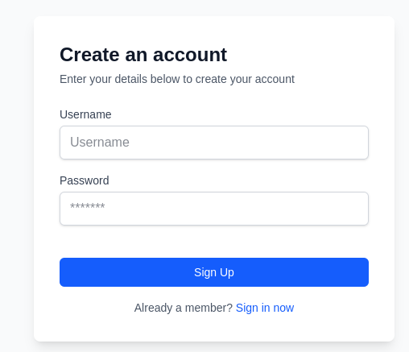

import { Tabs, Tab } from 'fumadocs-ui/components/tabs';


<div className="flex items-center justify-center">
  
  </div>

## Overview
The sign-up flow consists of these key components:

1. Server action for user registration
2. API route for handling sign-up requests
3. Client-side hook for managing sign-up state
4. User interface for registration


Let's break down each component step by step.

<div className="fd-steps">
  <div className="fd-step">
  **Authenticating with PrivMX Bridge**
  </div>

  First, we need to create a function to obtain an access token from PrivMX Bridge. This token will be used to authenticate subsequent API requests.

    ```ts title="lib/bridge.ts"
    'use server';

    export async function getBridgeAccessToken() {
        // Create the request body with your API credentials
        const requestBody = {
            jsonrpc: '2.0',
            id: 128,
            method: 'manager/auth',
            params: {
                scope: ['solution:*', 'context'],
                grantType: 'api_key_credentials',
                apiKeyId: process.env.API_KEY_ID,
                apiKeySecret: process.env.API_KEY_SECRET
            }
        };

        // Send request to the Bridge API
        const tokenRequest = await fetch(process.env.BRIDGE_API_URL!, {
            method: 'POST',
            headers: {
                'Content-Type': 'application/json'
            },
            body: JSON.stringify(requestBody)
        });

        const response = await tokenRequest.json();

        // Handle errors in the response
        if ('error' in response) {
            console.error(response.error);
            throw new Error('Unable to get access token');
        }

        // Return the access token if successful
        if (tokenRequest.status === 200) {
            return response.result.accessToken;
        }

        throw new Error('Error getting access token');
    }
    ```
    **How this works**:

    - The function creates a JSON-RPC request with your API credentials
    - It sends this request to the PrivMX Bridge API endpoint
    - Upon success, it returns the access token
    - If there's an error, it throws an appropriate exception


    <div className="fd-step">
    **Creating a Server Action for User Registration**
    </div>
    
    Next, we'll create a server action that adds a user to a specific context within PrivMX.

  ```ts title="lib/actions/register-user.ts"
  'use server';

    import { SignUpPayload } from '@/app/api/sign-up/route';
    import { getBridgeAccessToken } from '@/lib/bridge';

    export async function addUserToContext(
        payload: SignUpPayload
    ): Promise<{ status: 'success' | 'error'; message: string }> {
        // Get the context ID from environment variables
        const contextId = process.env.NEXT_PUBLIC_CONTEXT_ID;

        try {
            const accessToken = await getBridgeAccessToken();

            // Prepare request to add user to context
            const requestBody = {
                jsonrpc: '2.0',
                id: 128,
                method: 'context/addUserToContext',
                params: {
                    contextId: contextId,
                    userId: payload.userId,
                    userPubKey: payload.publicKey
                }
            };

            // Send the request
            const addToContextRequest = await fetch(process.env.BRIDGE_API_URL!, {
                method: 'POST',
                headers: {
                    'Content-Type': 'application/json',
                    Authorization: `Bearer ${accessToken}`
                },
                body: JSON.stringify(requestBody)
            });

            const response = await addToContextRequest.json();

            // Handle error in response
            if ('error' in response) {
                return {
                    status: 'error',
                    message: response.error.message
                };
            }

            // Check status code
            if (addToContextRequest.status !== 200) {
                return {
                    status: 'error',
                    message: 'Error adding user to context'
                };
            }

            return {
                status: 'success',
                message: 'Successfully signed up!'
            };
        } catch (error) {
            return {
                status: 'error',
                message: error instanceof Error ? error.message : 'An unexpected error occurred'
            };
        }
    }
  ```
    **What this server action does**:

    - Takes a `SignUpPayload` containing the user ID and public key
    - Gets an access token from PrivMX Bridge using our previous function
    - Sends a request to add the user to the specified context


    <div className="fd-step">
    **Creating an API Route for Sign-Up**
    </div>

    Now, let's create a Next.js API route to handle sign-up requests from the client.

    First, let's install [**zod**](https://zod.dev/) for input validation

    ```package-install
    npm i zod
    ```

    Then create the sign-up route:

  ```ts title="app/api/sign-up/route.ts"
  import { addUserToContext } from '@/lib/actions/register-user';
  import { NextResponse } from 'next/server';
  import z from 'zod';

// Define the schema for validating sign-up payload
  export const signUpSchema = z.object({
      userId: z.string(),
      publicKey: z.string()
  });
// Export the type for use in other files

  export type SignUpPayload = z.infer<typeof signUpSchema>;

  export async function POST(request: Request) {
      try {
        // Parse the request body
          const body = await request.json();

        // Validate the input
          const { success, data, error } = signUpSchema.safeParse(body);
          if (!success) {
              return NextResponse.json(
                  {
                      message: error
                  },
                  {
                      status: 400
                  }
              );
          }
        // Call the server action to add the user
          const { status, message } = await addUserToContext(data);


        // Return appropriate response
          if (status === 'success') {
              return NextResponse.json(
                  {
                      message
                  },
                  {
                      status: 201
                  }
              );
          }

          return NextResponse.json(
              {
                  message
              },
              { status: 500 }
          );
      } catch (e) {
          return NextResponse.json(
              {
                  message: e
              },
              { status: 500 }
          );
      }
  }
  ```
    **What this API route does**:

    - Validates the incoming request data using Zod schema
    - Calls our server action to register the user
    - Returns appropriate HTTP responses based on the outcome
    - Handles any exceptions that may occur

  <div className="fd-step">
  **Creating a Hook for Sign-Up Logic**
  </div>

  Now, let's create a React hook to manage the sign-up process on the client side:


  ```ts title="hooks/useSignUp.ts"
  'use client';

  import { SignUpPayload } from '@/app/api/sign-up/route';
  import { PrivmxClient } from '@/lib/PrivmxClient';
  import { useState } from 'react';

    // Define possible states for the sign-up process
  interface DefaultState {
      type: 'default';
  }

  interface LoadingState {
      type: 'loading';
  }

  interface ErrorState {
      type: 'error';
      message: string;
  }

  interface SuccessState {
      type: 'success';
      message: string;
  }

  type FormState = DefaultState | LoadingState | ErrorState | SuccessState;

  export function useSignUp() {
        // Initialize state

      const [status, setStatus] = useState<FormState>({ type: 'default' });

      const signUp = async (username: string, password: string) => {
          setStatus({ type: 'loading' });
          try {
            // Get cryptographic API
              const cryptoApi = await PrivmxClient.getCryptoApi();

            // Generate keys from username and password
              const privateKey = await cryptoApi.derivePrivateKey2(username, password);
              const publicKey = await cryptoApi.derivePublicKey(privateKey);

            // Prepare sign-up payload
              const signUpBody: SignUpPayload = {
                  userId: username,
                  publicKey
              };

            // Send sign-up request
              const signUpRequest = await fetch('/api/sign-up', {
                  body: JSON.stringify(signUpBody),
                  method: 'POST'
              });


            // Handle response

              if (signUpRequest.status !== 201) {
                  setStatus({ type: 'error', message: 'Sign-up failed.' });
                  return;
              }

              setStatus({ type: 'success', message: 'Sign-up successful!' });
          } catch (e) {
              console.error(e);
              setStatus({
                  type: 'error',
                  message: 'An unexpected error occurred during sign-up.'
              });
          }
      };

      return { signUp, status };
  }
  ```
  **How this hook works:**

    - Provides a signUp function that:
        - Derives cryptographic keys from the username and password
        - Sends the sign-up request to our API endpoint
        - Updates the status based on the response
    - Returns both the signUp function and current status for use in components

  <div className="fd-step">
  **Creating the Sign-Up Form Component**
  </div>
    Finally, let's create the UI component for our sign-up form:

  ```ts title="app/sign-up/page.tsx"
  'use client';

  import { useSignUp } from '@/hooks/useSignUp';
  import Link from 'next/link';
  import { useState } from 'react';

  export default function SignUpForm() {
    // Use our sign-up hook
      const { signUp, status } = useSignUp();

    // Local state for form fields
      const [formState, setFormState] = useState<{
          username: string;
          password: string;
      }>({
          username: '',
          password: ''
      });

    // Handle input changes
      const handleChange = (e: React.ChangeEvent<HTMLInputElement>) => {
          const { name, value } = e.target;
          setFormState((prevState) => ({
              ...prevState,
              [name]: value
          }));
      };

    // Handle form submission
      const handleSubmit = async (e: React.FormEvent) => {
          e.preventDefault();
          await signUp(formState.username, formState.password);
      };

      return (
          <div className="flex min-h-screen items-center justify-center bg-gray-50 p-4">
              <div className="w-full max-w-md rounded-lg bg-white p-8 shadow-lg">
                  <div className="mb-6">
                      <h2 className="text-2xl font-bold text-gray-900">Create an account</h2>
                      <p className="mt-1 text-sm text-gray-600">
                          Enter your details below to create your account
                      </p>
                  </div>

                  <form className="space-y-4" onSubmit={handleSubmit}>
                      <div>
                          <label
                              htmlFor="username"
                              className="block text-sm font-medium text-gray-700">
                              Username
                          </label>
                          <input
                              id="username"
                              name="username"
                              type="text"
                              placeholder="Username"
                              required
                              className="mt-1 block w-full rounded-md border border-gray-300 px-3 py-2 text-gray-900 shadow-sm focus:border-blue-500 focus:outline-none focus:ring-1 focus:ring-blue-500"
                              value={formState.username}
                              onChange={handleChange}
                          />
                      </div>

                      <div>
                          <label
                              htmlFor="password"
                              className="block text-sm font-medium text-gray-700">
                              Password
                          </label>
                          <input
                              id="password"
                              name="password"
                              type="password"
                              placeholder="*******"
                              required
                              className="mt-1 block w-full rounded-md border border-gray-300 px-3 py-2 text-gray-900 shadow-sm focus:border-blue-500 focus:outline-none focus:ring-1 focus:ring-blue-500"
                              value={formState.password}
                              onChange={handleChange}
                          />
                      </div>

                      <button
                          type="submit"
                          className="mt-6 w-full rounded-md bg-blue-600 px-4 py-2 text-sm font-medium text-white hover:bg-blue-700 focus:outline-none focus:ring-2 focus:ring-blue-500 focus:ring-offset-2"
                          disabled={status.type === 'loading'}>
                          {status.type === 'loading' ? 'Signing Up...' : 'Sign Up'}
                      </button>

                      {status.type === 'error' && (
                          <p className="text-red-500">{status.message || 'Error signing up'}</p>
                      )}

                      {status.type === 'success' && (
                          <p className="text-green-500">
                              {status.message || 'Successfully signed up!'}
                          </p>
                      )}
                  </form>

                  <p className="mt-4 text-center text-sm text-gray-600">
                      Already a member?{' '}
                      <Link href="/" className="font-medium text-blue-600 hover:text-blue-500">
                          Sign in now
                      </Link>
                  </p>
              </div>
          </div>
      );
  }
  ```
    **What the form component does:**

    - Uses our useSignUp hook to handle the sign-up logic
    - Maintains local state for form inputs
    - Handles form submission and input changes
    - Displays appropriate feedback based on the current status
    - Provides a link to the sign-in page for existing users
</div>


## How Everything Works Together

1. User enters their username and password in the sign-up form
2. On form submission, the useSignUp hook:
    - Generates cryptographic keys from the credentials
    - Sends the user ID and public key to the API route
3. The API route:
    - Validates the incoming data
    - Calls the server action to register the user
4. The server action:
    - Gets an access token from PrivMX Bridge
    - Uses the token to add the user to the specified context
5. The result is returned to the client and displayed to the user