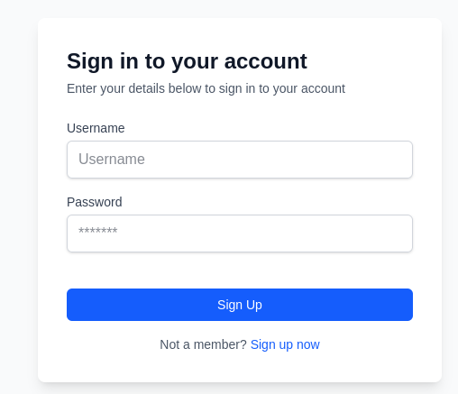

import { Tabs, Tab } from 'fumadocs-ui/components/tabs';

<div className="flex items-center justify-center">
  
</div>

### Overview

The login system uses: 
- React Context API for state management
- Custom hooks for authentication logic

<div className="fd-steps">
  <div className="fd-step">
  **Create the PrivmxContext** 
  </div>
    First, we'll create a context to manage user connections and notes throughout the application.
    The context provides:

    - Client connection management
    - Thread ID tracking
    - Notes data storage

    ```tsx title="context/PrivmxContext.tsx"
    import { PrivmxClient } from '@/lib/PrivmxClient';
    import { Types } from '@simplito/privmx-webendpoint';
    import { createContext, ReactNode, useContext, useEffect, useReducer } from 'react';

    // Define the state structure for our context
    type PrivmxState = {
        client: PrivmxClient | null;
        threadId?: string;
        notes: Types.Message[];
    };

    // Define possible actions for our reducer
    type PrivmxAction =
        | { type: 'SET_CLIENT'; payload: PrivmxClient }
        | { type: 'SET_THREAD_ID'; payload: string }
        | { type: 'SET_NOTES'; payload: Types.Message[] }

    const initialState: PrivmxState = {
        client: null,
        threadId: undefined,
        notes: []
    };
    ```

    The reducer function handles state updates based on dispatched actions:
    ```ts title="context/PrivmxContext.tsx"

    // Reducer to handle state updates
    function privmxReducer(state: PrivmxState, action: PrivmxAction): PrivmxState {
        switch (action.type) {
            case 'SET_CLIENT':
                return { ...state, client: action.payload };
            case 'SET_THREAD_ID':
                return { ...state, threadId: action.payload };
            case 'SET_NOTES':
                return { ...state, notes: action.payload };
            default:
                return state;
        }
    }
    ```

    Now let's create the context and provider component:

    ```ts title="context/PrivmxContext.tsx"
    // Create the context with default values
    const PrivmxContext = createContext<{
        client: PrivmxClient | null;
        setConnection: (client: PrivmxClient) => void;
        setThreadId: (threadId: string) => void;
        threadId?: string;
        notes?: Types.Message[];
    }>({
        client: null,
        setConnection: () => {},
        setThreadId: () => {}
    });

    // Custom hook for easy context consumption
    export const usePrivmxContext = () => {
        const ctx = useContext(PrivmxContext);

        if (!ctx) {
            throw new Error('usePrivmxContext can only be use inside a PrivmxProvider');
        }

        return ctx;
    };

    export const PrivmxProvider = ({ children }: { children: ReactNode }) => {
        const [state, dispatch] = useReducer(privmxReducer, initialState);

        useEffect(() => {
            PrivmxClient.setup('/privmx-assets');
        }, []);

        const setConnection = (client: PrivmxClient) => {
            dispatch({ type: 'SET_CLIENT', payload: client });
        };

        const setThreadId = (threadId: string) => {
            dispatch({ type: 'SET_THREAD_ID', payload: threadId });
        };

        useEffect(() => {
            (async () => {
                if (state.threadId && state.client) {
                    // Fetch all notes
                    const threadApi = await state.client.getThreadApi();
                    const messages = await threadApi.listMessages(state.threadId, {
                        limit: 100,
                        skip: 0,
                        sortOrder: 'desc'
                    });
                    dispatch({ type: 'SET_NOTES', payload: messages.readItems });
                }
            })();
        }, [state.threadId, state.client]);


        return (
            <PrivmxContext.Provider
                value={{
                    client: state.client,
                    setConnection,
                    setThreadId,
                    threadId: state.threadId,
                    notes: state.notes
                }}>
                {children}
            </PrivmxContext.Provider>
        );
    };
    ```

    <div className="fd-step">
        Set Up the Provider in Your Layout
    </div>

    Wrap your application with the PrivmxProvider to make the context available throughout:

    ```ts title="app/layout.tsx"
    import type { Metadata } from 'next';
    import { Geist, Geist_Mono } from 'next/font/google';
    import './globals.css';
    import { PrivmxProvider } from '../context/PrivmxContext';

    const geistSans = Geist({
        variable: '--font-geist-sans',
        subsets: ['latin']
    });

    const geistMono = Geist_Mono({
        variable: '--font-geist-mono',
        subsets: ['latin']
    });

    export const metadata: Metadata = {
        title: 'Simple notes app',
    };

    export default function RootLayout({
        children
    }: Readonly<{
        children: React.ReactNode;
    }>) {
        return (
            <html lang="en">
                <body className={`${geistSans.variable} ${geistMono.variable} antialiased`}>
                    <PrivmxProvider>{children}</PrivmxProvider> // [!code highlight]
                </body>
            </html>
        );
    }
    ```

    <div className="fd-step">
       **Create a Sign-In Hook**
    </div>


    Next, we'll create a custom hook to handle the sign-in process:
    ```ts title="hooks/useSignIn.ts"

    'use client';

    import { usePrivmxContext } from '@/context/PrivmxContext';
    import { PrivmxClient } from '@/lib/PrivmxClient';
    import { useState } from 'react';

    interface DefaultState {
        type: 'default';
    }

    interface LoadingState {
        type: 'loading';
    }

    interface ErrorState {
        type: 'error';
        message: string;
    }

    interface SuccessState {
        type: 'success';
        message: string;
    }

    type FormState = DefaultState | LoadingState | ErrorState | SuccessState;
    ```

    Now let's implement the actual hook functionality:

    ```ts title="hooks/useSignIn.ts"

    export function useSignIn() {
        const [status, setStatus] = useState<FormState>({ type: 'default' });
        const { setConnection, setThreadId } = usePrivmxContext();

        const signIn = async (username: string, password: string) => {
            setStatus({ type: 'loading' });
            try {
                 // Step 1: Create private key based on user credentials
                const cryptoApi = await PrivmxClient.getCryptoApi();
                const privateKey = await cryptoApi.derivePrivateKey2(username, password);

                // Step 2: Connect to the PrivMX Bridge
                const connection = await PrivmxClient.connect(
                    privateKey,
                    process.env.NEXT_PUBLIC_SOLUTION_ID!,
                    process.env.NEXT_PUBLIC_BRIDGE_URL!
                );

                // Step 3: Update application state with the new connection
                setStatus({ type: 'success', message: 'Sign-up successful!' });
                setConnection(connection);

                // Step 4: List available threads
                const threadApi = await connection.getThreadApi();
                const threads = await threadApi.listThreads(process.env.NEXT_PUBLIC_CONTEXT_ID!, {
                    limit: 10,
                    skip: 0,
                    sortOrder: 'desc'
                });

                // Step 5: Either create a new thread or use an existing one
                if (threads.totalAvailable === 0) {
                    // If no threads exist, create a new one
                    const userPubKey = await cryptoApi.derivePublicKey(privateKey);
                    const threadId = await threadApi.createThread(
                        process.env.NEXT_PUBLIC_CONTEXT_ID!,
                        [
                            {
                                userId: username,
                                pubKey: userPubKey
                            }
                        ],
                        [
                            {
                                userId: username,
                                pubKey: userPubKey
                            }
                        ],
                        new Uint8Array(),
                        new Uint8Array()
                    );

                    setThreadId(threadId);
                } else {
                      // If a thread already exists, use the first one
                    setThreadId(threads.readItems[0].threadId);
                }
            } catch (e) {
                console.error(e);
                setStatus({
                    type: 'error',
                    message: e as string
                });
            }
        };

        return { signIn, status };
    }   
  ```


  <div className="fd-step">
  **Create the Sign-In Form Component**
  </div>

    Now let's create the UI component that users will interact with:

  ```tsx title="components/SignInForm.tsx"
  'use client';

  import { useSignIn } from '@/hooks/useSignIn';
  import Link from 'next/link';
  import { useState } from 'react';

  export function SignInForm() {
        // Use our custom hook for sign-in functionality
        const { signIn, status } = useSignIn();

        // Local state for form inputs

        const [formState, setFormState] = useState<{
            username: string;
            password: string;
        }>({
            username: '',
            password: ''
        });

        // Handle input changes
        const handleChange = (e: React.ChangeEvent<HTMLInputElement>) => {
            const { name, value } = e.target;
            setFormState((prevState) => ({
                ...prevState,
                [name]: value
            }));
        };

        // Handle form submission
        const handleSubmit = async (e: React.FormEvent) => {
            e.preventDefault();
            await signIn(formState.username, formState.password);
        };
    ```

    Now let's implement the form UI:

    ```tsx title="components/SignInForm.tsx"

      return (
          <div className="w-full max-w-md rounded-lg bg-white p-8 shadow-lg">
              <div className="mb-6">
                  <h2 className="text-2xl font-bold text-gray-900">Sign in to your account</h2>
                  <p className="mt-1 text-sm text-gray-600">
                      Enter your details below to sign in to your account
                  </p>
              </div>
              <form className="space-y-4" onSubmit={handleSubmit}>
                  <div>
                      <label htmlFor="username" className="block text-sm font-medium text-gray-700">
                          Username
                      </label>
                      <input
                          id="username"
                          name="username"
                          type="text"
                          placeholder="Username"
                          required
                          className="mt-1 block w-full rounded-md border border-gray-300 px-3 py-2 text-gray-900 shadow-sm focus:border-blue-500 focus:outline-none focus:ring-1 focus:ring-blue-500"
                          value={formState.username}
                          onChange={handleChange}
                      />
                  </div>

                  <div>
                      <label htmlFor="password" className="block text-sm font-medium text-gray-700">
                          Password
                      </label>
                      <input
                          id="password"
                          name="password"
                          type="password"
                          placeholder="*******"
                          required
                          className="mt-1 block w-full rounded-md border border-gray-300 px-3 py-2 text-gray-900 shadow-sm focus:border-blue-500 focus:outline-none focus:ring-1 focus:ring-blue-500"
                          value={formState.password}
                          onChange={handleChange}
                      />
                  </div>

                  <button
                      type="submit"
                      className="mt-6 w-full rounded-md bg-blue-600 px-4 py-2 text-sm font-medium text-white hover:bg-blue-700 focus:outline-none focus:ring-2 focus:ring-blue-500 focus:ring-offset-2"
                      disabled={status.type === 'loading'}>
                      {status.type === 'loading' ? 'Signing Up...' : 'Sign Up'}
                  </button>

                  {status.type === 'error' && (
                      <p className="text-red-500">{status.message || 'Error signing up'}</p>
                  )}

                  {status.type === 'success' && (
                      <p className="text-green-500">{status.message || 'Successfully signed up!'}</p>
                  )}
              </form>
              <p className="mt-4 text-center text-sm text-gray-600">
                  Not a member?{' '}
                  <Link href="/sign-up" className="font-medium text-blue-600 hover:text-blue-500">
                      Sign up now
                  </Link>
              </p>
          </div>
      );
  }
  ```

  <div className="fd-step">
    Use the Sign-In Form on Your Home Page
  </div>

    Finally, add the sign-in form to your home page:

    ```ts title="app/page.tsx"
    'use client';
    import { SignInForm } from '@/components/SignInForm';
    import { usePrivmxContext } from '../context/PrivmxContext';

    export default function Page() {
        const { client } = usePrivmxContext();
        return (
            <div className="flex min-h-screen items-center justify-center bg-gray-50 p-4 text-gray-900">
                {client === null ? <SignInForm /> : 'Connected'}
            </div>
        );
    }
    ```
</div>

### Key Concepts

1. **Context Management**: The PrivmxContext provides application-wide state management for user authentication.
2. **Custom Hooks**: The useSignIn hook encapsulates all authentication logic, making it reusable across the application.
3. **Form State Handling**: The form tracks multiple states (loading, error, success) to provide feedback to users.
4. **Thread Management**: Upon successful authentication, the application either creates a new thread or uses an existing one.
5. **User Experience**: The sign-in form includes appropriate loading states, error messages, and a link to sign up.


### Implementation Flow

1. User enters username and password
2. The application derives a private key from these credentials
3. It establishes a connection with the PrivMX service
4. It retrieves or creates a thread for the user
5. It updates the application state with the connection and thread information
6. The UI reflects the authenticated state