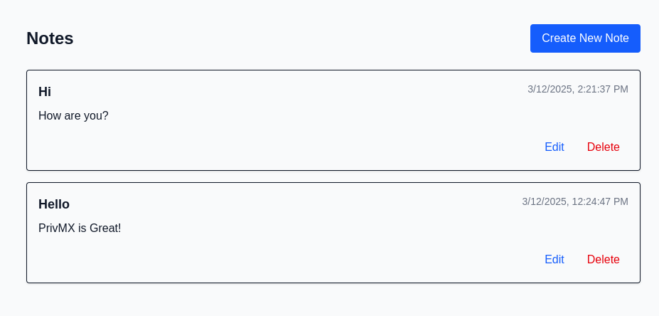

import { Tabs, Tab } from 'fumadocs-ui/components/tabs';

<div className="flex items-center justify-center">
  
</div>


## Overview
The notes functionality allows users to:

- Create new notes with title and content
- View a list of existing notes
- Edit note titles and content
- Delete unwanted notes

<div className="fd-steps">
  <div className="fd-step">
  Create Components for Note Handling
  </div>

  We'll create four main components to handle different aspects of note management:

  1. **NewNoteForm**: For creating new notes
  2. **EditNoteForm**: For modifying existing notes
  3. **NoteDisplay**: For displaying individual notes
  4. **NoteList**: The main component that manages all note operations

  <div className="fd-step">
  Create the NewNoteForm Component
  </div>

  This component provides a form for creating new notes with a title and content.

   ```ts title="components/NewNoteForm.tsx"
    import { useState } from 'react';

    export function NewNoteForm({
        onCreate,
        onCancel,
        loading
    }: {
        onCreate: (title: string, content: string) => void;
        onCancel: () => void;
        loading: boolean;
    }) {
        // State for tracking form inputs
        const [newNoteText, setNewNoteText] = useState('');
        const [newNoteContent, setNewNoteContent] = useState('');

        const handleCreate = () => {
            onCreate(newNoteText.trim(), newNoteContent.trim());

            // Reset form after submission
            setNewNoteText('');
            setNewNoteContent('');
        };

        return (
            <div className="mb-6 p-4 border rounded shadow-sm">
                <input
                    type="text"
                    className="w-full p-2 border rounded mb-2"
                    placeholder="Enter your note title..."
                    value={newNoteText}
                    onChange={(e) => setNewNoteText(e.target.value)}
                />
                <textarea
                    className="w-full h-32 p-2 border rounded mb-4"
                    placeholder="Enter your note content..."
                    value={newNoteContent}
                    onChange={(e) => setNewNoteContent(e.target.value)}
                />
                <div className="flex justify-end gap-2">
                    <button
                        onClick={onCancel}
                        className="px-3 py-1 border rounded hover:bg-gray-100"
                        disabled={loading}>
                        Cancel
                    </button>
                    <button
                        onClick={handleCreate}
                        className="px-3 py-1 bg-green-600 text-white rounded hover:bg-green-700"
                        disabled={loading || !newNoteText.trim()}>
                        {loading ? 'Saving...' : 'Save Note'}
                    </button>
                </div>
            </div>
        );
    }
    ```

  **Key poin ts about NewNoteForm:**
  - Uses React state to track title and content inputs
  - Disables the save button if the title is empty or while saving
  - Shows a loading state during save operations
  - Provides cancel functionality to exit note creation


  <div className="fd-step">
  Create the EditNoteForm Component
  </div>
  This component allows users to modify existing notes.

   ```ts title="components/EditNoteForm.tsx"
    import { Types } from '@simplito/privmx-webendpoint';
    import { Utils } from '@simplito/privmx-webendpoint/extra';
    import { useState } from 'react';

    export function NoteEditForm({
      note,
      onSave,
      onCancel,
      loading
    }: {
      note: Types.Message;
      onSave: (messageId: string, title: string, content: string) => void;
      onCancel: () => void;
      loading: boolean;
    }) {
      // Initialize form with existing note data
      const [editTitle, setEditTitle] = useState(Utils.deserializeObject(note.privateMeta).title);
      const [editContent, setEditContent] = useState(Utils.deserializeObject(note.data).content);

      return (
          <div className="space-y-2">
              <input
                  type="text"
                  className="w-full p-2 border rounded"
                  value={editTitle}
                  onChange={(e) => setEditTitle(e.target.value)}
              />
              <textarea
                  className="w-full h-32 p-2 border rounded"
                  value={editContent}
                  onChange={(e) => setEditContent(e.target.value)}
              />
              <div className="flex justify-end gap-2">
                  <button
                      onClick={onCancel}
                      className="px-3 py-1 border rounded hover:bg-gray-100"
                      disabled={loading}>
                      Cancel
                  </button>
                  <button
                      onClick={() => onSave(note.info.messageId, editTitle, editContent)}
                      className="px-3 py-1 bg-green-600 text-white rounded hover:bg-green-700"
                      disabled={loading || !editTitle.trim()}>
                      {loading ? 'Saving...' : 'Save Changes'}
                  </button>
              </div>
          </div>
      );
    }
    ```

  **Key points about EditNoteForm:**
  - Pre-populates form fields with existing note data
  - Uses PrivMX's utility functions to deserialize stored data
  - Provides similar save/cancel functionality as the new note form
  - Validates that the title is not empty before allowing save

  <div className="fd-step">
  Create the NoteDisplay Component
  </div>

  This component handles the display of individual notes.

  ```ts title="components/NoteDisplay.tsx"
  import { Types } from '@simplito/privmx-webendpoint';
  import { Utils } from '@simplito/privmx-webendpoint/extra';

  export function NoteDisplay({
    note,
    onEdit,
    onDelete
  }: {
    note: Types.Message;
    onEdit: (note: Types.Message) => void;
    onDelete: (messageId: string) => void;
  }) {
    // Extract note data from PrivMX message format
    const title = Utils.deserializeObject(note.privateMeta).title;
    const content = Utils.deserializeObject(note.data).content;

    return (
        <>
            <div className="flex justify-between items-start mb-2">
                <h3 className="text-lg font-semibold">{title}</h3>
                <div className="text-sm text-gray-500">
                    {new Date(note.info.createDate).toLocaleString()}
                </div>
            </div>
            <div className="mb-4 prose max-w-none">
                <p>{content}</p>
            </div>
            <div className="flex justify-end gap-2">
                <button
                    onClick={() => onEdit(note)}
                    className="px-3 py-1 text-blue-600 hover:bg-blue-50 rounded">
                    Edit
                </button>
                <button
                    onClick={() => onDelete(note.info.messageId)}
                    className="px-3 py-1 text-red-600 hover:bg-red-50 rounded">
                    Delete
                </button>
            </div>
        </>
    );
  }
  ```
  **Key points about NoteDisplay:**

  - Displays the note title, content, and creation timestamp
  - Provides edit and delete buttons for note management
  - Uses PrivMX utilities to extract data from the message format
  - Formats the creation date for better readability


  <div className="fd-step">
  Create the NoteList Component
  </div>

  This is the main component that brings everything together and manages all note operations.

  ```ts title="components/NoteList.tsx"
  // Part 1: Imports and component setup

  import { usePrivmxContext } from '@/context/PrivmxContext';
  import { Utils } from '@simplito/privmx-webendpoint/extra';
  import { useState } from 'react';
  import { NewNoteForm } from './NewNoteForm';
  import { NoteEditForm } from './EditNoteForm';
  import { NoteDisplay } from './NoteDisplay';

  export default function NoteList() {
    // Get PrivMX context data
    const { client, notes, threadId } = usePrivmxContext();

    // Component state
    const [isCreating, setIsCreating] = useState(false);
    const [loading, setLoading] = useState(false);
    const [editingNote, setEditingNote] = useState<string | null>(null);
  ```

  This first part sets up the component with necessary imports and state variables:

  - `isCreating`: Tracks if the new note form should be displayed
  - `loading`: Manages loading state during API operations
  - `editingNote`: Tracks which note is currently being edited (if any)

  ```ts title="components/NoteList.tsx"
     // Part 2: Note creation function

    // Create a new note
    const createNote = async (title: string, content: string) => {
        if (!client || !threadId || !title.trim()) {
            return;
        }

        setLoading(true);
        try {
            const threadApi = await client.getThreadApi();
            await threadApi.sendMessage(
                threadId,
                new Uint8Array(), // Public Meta
                Utils.serializeObject({ title: title.trim() }), // Private Meta
                Utils.serializeObject({ content: content.trim() }) // Data
            );
            setIsCreating(false);
        } catch (error) {
            console.error('Failed to create note:', error);
        } finally {
            setLoading(false);
        }
    };
    ```

    The `createNote` function:

    - Validates required data is available
    - Uses the PrivMX thread API to send a new message
    - Structures note data with title in privateMeta and content in data
    - Handles errors and loading state

    ```ts title="components/NoteList.tsx"
    // Part 3: Note deletion function

    // Delete a note
    const deleteNote = async (messageId: string) => {
        if (!client) return;

        if (window.confirm('Are you sure you want to delete this note?')) {
            setLoading(true);
            try {
                const threadApi = await client.getThreadApi();
                await threadApi.deleteMessage(messageId);
            } catch (error) {
                console.error('Failed to delete note:', error);
            } finally {
                setLoading(false);
            }
        }
    };
    ```

    The `deleteNote` function:

    - Confirms with the user before deletion
    - Uses the PrivMX API to remove the message
    - Handles errors and manages loading state

    ```ts title="components/NoteList.tsx"
    //Part 4: Note update functions

    // Update a note
    const updateNote = async (messageId: string, title: string, content: string) => {
        if (!client) return;
        const threadApi = await client.getThreadApi();

        await threadApi.updateMessage(
            messageId,
            new Uint8Array(),
            Utils.serializeObject({ title }),
            Utils.serializeObject({ content })
        );
    };

    // Save note update
    const saveNoteUpdate = async (messageId: string, title: string, content: string) => {
        if (!client || !title.trim()) return;

        setLoading(true);
        try {
            await updateNote(messageId, title, content);
            setEditingNote(null);
        } catch (error) {
            console.error('Failed to update note:', error);
        } finally {
            setLoading(false);
        }
    };
    ```
    
    These functions:

    - `updateNote`: Handles the core API call to update the message
    - `saveNoteUpdate`: Provides a wrapper with validation, error handling, and state management

    ```ts title="components/NoteList.tsx"
    // Part 5: Component render

    return (
        <div className="w-full max-w-4xl mx-auto p-4">
            {/* Header with title and create button */}
            <div className="flex justify-between items-center mb-6">
                <h1 className="text-2xl font-bold">Notes</h1>
                {!isCreating && (
                    <button
                        onClick={() => setIsCreating(true)}
                        className="px-4 py-2 bg-blue-600 text-white rounded hover:bg-blue-700 transition-colors"
                        disabled={!client || !threadId}>
                        Create New Note
                    </button>
                )}
            </div>

            {/* New note form (conditionally rendered) */}
            {isCreating && (
                <NewNoteForm
                    onCreate={createNote}
                    onCancel={() => setIsCreating(false)}
                    loading={loading}
                />
            )}

            {/* Connection status message */}
            {(!client || !threadId) && (
                <div className="text-center p-6 bg-gray-100 rounded">
                    <p>Connect to a PrivMX server and select a thread to view notes.</p>
                </div>
            )}

            {/* Empty state message */}
            {client && threadId && notes && notes.length === 0 && (
                <div className="text-center p-6 bg-gray-100 rounded">
                    <p>No notes found in this thread. Create your first note!</p>
                </div>
            )}

            {/* Note list */}
            <div className="space-y-4">
                {notes?.map((note) => (
                    <div key={note.info.messageId} className="p-4 border rounded shadow-sm">
                        {editingNote === note.info.messageId ? (
                            <NoteEditForm
                                note={note}
                                onSave={saveNoteUpdate}
                                onCancel={() => setEditingNote(null)}
                                loading={loading}
                            />
                        ) : (
                            <NoteDisplay
                                note={note}
                                onEdit={() => setEditingNote(note.info.messageId)}
                                onDelete={deleteNote}
                            />
                        )}
                    </div>
                ))}
            </div>
        </div>
    );
    ```
    The render method:

  - Provides a create button when not in creation mode
  - Conditionally renders the new note form
  - Shows appropriate status messages based on connection and note availability
  - Renders the list of notes, each with either display or edit mode based on state

  <div className="fd-step">
  Update the Home Page
  </div>

  Finally, update the main page to render the NoteList component when the user is signed in.

  ```ts title="app/page.tsx"
  'use client';

  import { SignInForm } from '@/components/SignInForm';
  import { usePrivmxContext } from '../context/PrivmxContext';
  import NoteList from '@/components/NoteList';

  export default function Page() {
      const { client } = usePrivmxContext();
      return (
          <div className="flex min-h-screen items-center justify-center bg-gray-50 p-4 text-gray-900">
              {client === null ? <SignInForm /> : <NoteList />} // [!code highlight]
          </div>
      );
  }
  ```
</div>

## Data Structure

Notes in PrivMX are stored as messages with the following structure:
- **Public Meta**: Empty (not used for notes)
- **Private Meta**: Contains the note title as `{ title: "Note Title" }`
- **Data**: Contains the note content as `{ content: "Note content text" }`

